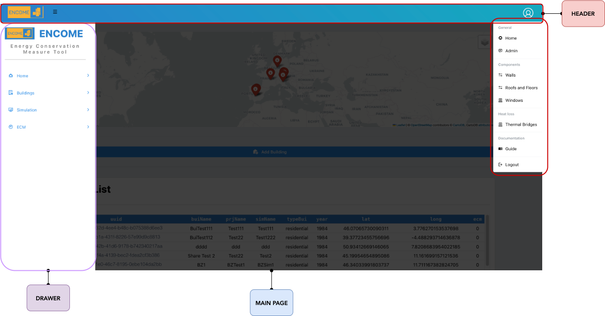

# Interface

The interface consists mainly of 3 basic parts:

  1. The **HEADER**: Selecting the "user" icon a drop-down menu will be shown. Within the latter, the following functions can be accessed:
```{r frontend, echo=FALSE, fig.cap="ENCOME frontend interface", out.width = '100%', out.height = '100%'}

```
      - **General**
      
          - *Home*: return all home page
          - *Admin*: link to the administrator page where user creation and management is possible. Only for administrator users. 
      
      - **Components**
        - *Walls*: link to the database of the available opaque vertical components 
        - *Roofs and Floors*: link to the database of available opaque horizontal components
        - *Windows*: link to the database of available transparent components
        
      - **Heat Loss**
        - *Thermal Bridges*: link to the abacus of thermal bridges 
      
      - **Documentation**
        - *Guide*: link to the guidelines of the tool
        
      - **Logout**: disconnection to the application
      
  2. The **DRAWER**: in the left drawer is it possible to visualize 4 main tool functionality: 
    
        - **Home**: Homepage of tool, where the list o buildings are visualized
        - **Building**: Page with building cards, to be selected for system and building inputs  
        - **Simulation**: Page with building cards for simulations, calibration,  and visualization of results
        - **ECM**: Page of building to apply Energy Conservation Measures (ECMs).
          - **Facade and Systems**: ECM applied to facade and systems. 
          - **PV Systems**: ECM of Photovoltaic. Where it is possible to simulate and optimize PV plan  
        
  3. The **MAIN PAGE**: in the main page the outputs of the tool are visualized.
  
  
      
    

