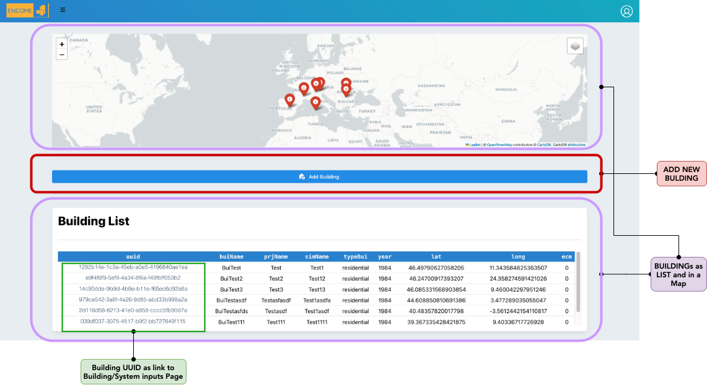
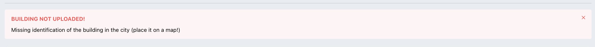
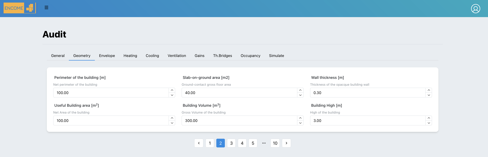
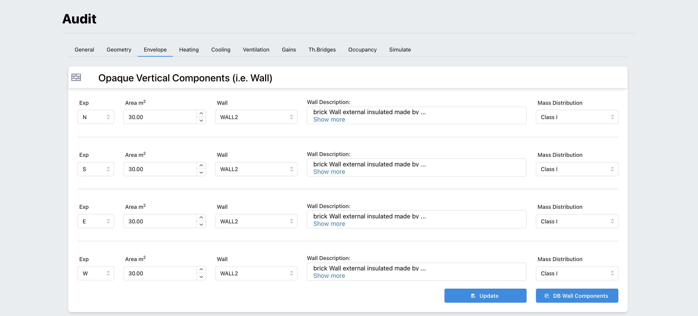

# Building 

```{r figurename, echo=FALSE, fig.cap="User Buildings", out.width = '90%'}

```

In the building page the user can visualize and mange all its buildings.

## Add new building

In order to create a new building the following information is required from the user: 

  - **Building Name**: name of the building
  - **Building Year**: year of construction
  - **Building Typology**: list of possible building typology (i.e. "school", "residential", "office", etc.)
  - **Project Name**: Name of the project to which the buildings belongs to.
  - **Simulation Name**: the building can be simulated several times, if you want to save the different simulations you need to identify it during the creation of the building

<span style="color:red"> **The user should place the building in the map. This step is important to connect the tool to the weather data (connection to PVGIS site https://re.jrc.ec.europa.eu/pvg_tools/en/ )**</span> 

If the building is not placed in the map an error will come up. 
```{r figurename1, echo=FALSE, fig.cap="Error if building is not placed in a map during the creation", out.width = '100%'}

```

## Buildings List

In a specific page it is possible to visualize the list of buildings as cards, selecting one the Audit inputs is opened.

```{r figurename2, echo=FALSE, fig.cap="List of buildings", out.width = '100%'}
knitr::include_graphics("image/BuildingLists.png")
```

## Audit page


In the audit page the user should provide inputs related to building and systems according to the ISO 52016. Th following 9 cards should be filled: 
  
  - **General**: in the general page a summary of the inputs provided during the creation of the building is shown.

```{r Audit, echo=FALSE, fig.cap="Audit - General Page", out.width = '100%'}
knitr::include_graphics("image/Audit.png")
```

  - **Geometry**: the following information should be provided:
    - *Perimeter* of the building [m]: it is the length, the linear measurement around an entire building in meter.
    - *Slab-on-ground area*: area of the building in contact to the ground in m^2^
    - *Wall thickness*: Average thickness of the external walls in meter
    - *Useful building area*:  total area of all enclosed spaces measured to the internal face of the external walls in in m^2^
    - *Building Volume*: Volume of the building in in m^3^
    - *height*: external height of the building in meter
    
```{r Geometry, echo=FALSE, fig.cap="Geometry Page", out.width = '100%'}

```
  
  - **Envelope**: In this tab all the information related to the properties of the Envelope should be provided.
    -*Opaque Vertical Components*: For each building exposure it is necessary to select all type of opaque vertical component. 
    The component is taken from a specific database provided by the tool and can be augmented with user-defined components.  
    Access to the database can be done directly through the button below : "DB Wall Components" or through the user drop-down menu in the user section at the top of the header:
    *Components* -> *Walls*

```{r OpaqueVert, echo=FALSE, fig.cap="Geometry Page", out.width = '100%'}

```


