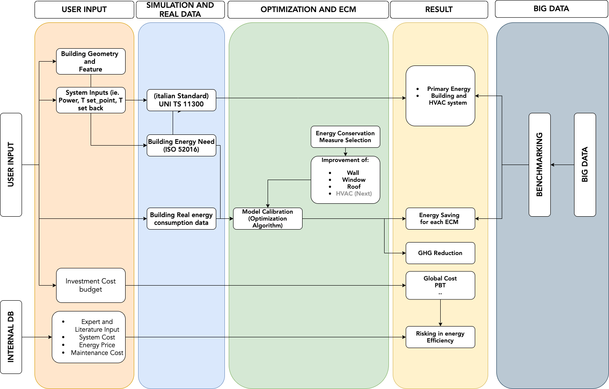
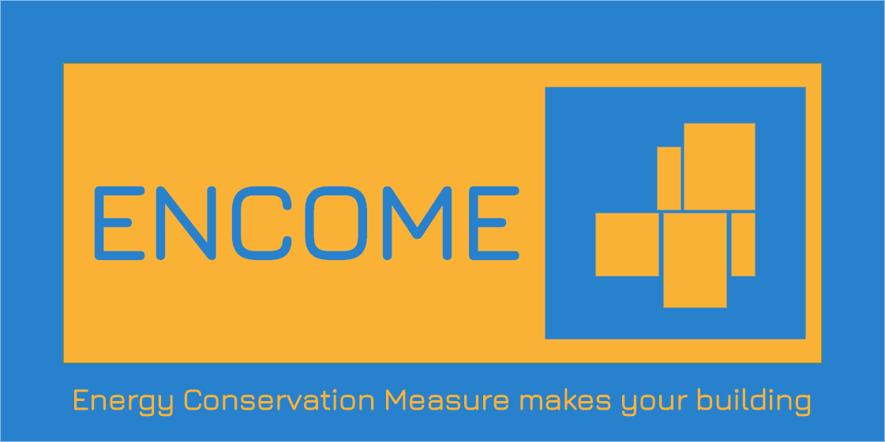

--- 
title: "ENCOME - Energy Conservation Measure Tool"
author: "Daniele Antonucci, Ulrich Filippi Oberagger, Olga Somova, Mattia Dallapiccola"
date: "`r Sys.Date()`"
site: bookdown::bookdown_site
documentclass: book
bibliography: [book.bib, packages.bib]
# url: your book url like https://bookdown.org/yihui/bookdown
# cover-image: path to the social sharing image like images/cover.jpg
description: |
  This is a minimal example of using the bookdown package to write a book.
  The HTML output format for this example is bookdown::gitbook,
  set in the _output.yml file.
link-citations: yes
github-repo: https://danieleantonucci20.github.io/ENCOME_guidelines/
---


# About

Increasing the energy efficiency of existing buildings is a priority from three different points of view: the environment, the security of energy supply and the quality of life of citizens. The renovation of existing buildings has a particularly high potential. It is therefore logical, from an economic and operational point of view, to implement appropriate energy saving measures when a building is renovated. The ENergy COnservation MEasure (ENCOME) tool developed by Eurac in different projects (MATRYCS, MODERATE, INFINITE) aims to evaluate the best trad-off between reduction of energy consumption of building and improving comfort, cost of interventions and de-risking on energy efficiency.


## How it works 

```{r figurename, echo=FALSE, fig.cap="Flow-chart of ENCOME tool", out.width = '90%'}

```


Each **bookdown** chapter is an .Rmd file, and each .Rmd file can contain one (and only one) chapter. A chapter *must* start with a first-level heading: `# A good chapter`, and can contain one (and only one) first-level heading.

Use second-level and higher headings within chapters like: `## A short section` or `### An even shorter section`.

The `index.Rmd` file is required, and is also your first book chapter. It will be the homepage when you render the book.

## Render book

You can render the HTML version of this example book without changing anything:

1. Find the **Build** pane in the RStudio IDE, and

1. Click on **Build Book**, then select your output format, or select "All formats" if you'd like to use multiple formats from the same book source files.

Or build the book from the R console:

```{r, eval=FALSE}
bookdown::render_book()
```

To render this example to PDF as a `bookdown::pdf_book`, you'll need to install XeLaTeX. You are recommended to install TinyTeX (which includes XeLaTeX): <https://yihui.org/tinytex/>.

## Preview book

As you work, you may start a local server to live preview this HTML book. This preview will update as you edit the book when you save individual .Rmd files. You can start the server in a work session by using the RStudio add-in "Preview book", or from the R console:

```{r eval=FALSE}
bookdown::serve_book()
```


```{r include=FALSE}
# automatically create a bib database for R packages
knitr::write_bib(c(
  .packages(), 'bookdown', 'knitr', 'rmarkdown'
), 'packages.bib')
```

```{js, echo = FALSE}
title=document.getElementById('header');
title.innerHTML = '' + title.innerHTML
```
